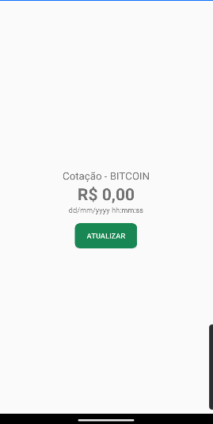
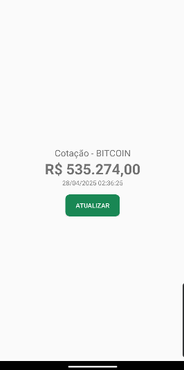

# Android Crypto Monitor - Atividade Kotlin

Este projeto simula um monitoramento simples de criptomoedas usando Kotlin.

## Arquivos

### [1. `TickerResponse.kt`](app/src/main/java/isabellaagm/com/github/android_crypto_monitor/model/TickerResponse.kt)
A estrutura foi criada para mapear o JSON retornado pela API, facilitando o processo de desserialização e o uso das informações no aplicativo.

- Contém duas classes:
  - `TickerResponse`: objeto principal que contém um campo `ticker`.
  - `Ticker`: modelo de dados com as seguintes informações:
    - `high`: Maior preço da criptomoeda no período.
    - `low`: Menor preço da criptomoeda no período.
    - `vol`: Volume negociado.
    - `last`: Último preço negociado.
    - `buy`: Preço de compra.
    - `sell`: Preço de venda.
    - `date`: Data da cotação.

### [2. `MercadoBitcoinService.kt`](app/src/main/java/isabellaagm/com/github/android_crypto_monitor/service/MercadoBitcoinService.kt)
Interface que define a chamada HTTP para a API do Mercado Bitcoin.

Utiliza Retrofit para realizar a requisição:
  - `@GET("api/BTC/ticker/")`
  - Função `suspend fun getTicker(): Response<TickerResponse>`
Interface que descreve as operações de serviço, como buscar a lista de criptomoedas.

### [3. `MercadoBitcoinServiceFactory.kt`](app/src/main/java/isabellaagm/com/github/android_crypto_monitor/service/MercadoBitcoinServiceFactory.kt)
Classe responsável por criar uma instância de `MercadoBitcoinService`.
- Configura Retrofit com:
  - URL base: `https://www.mercadobitcoin.net/`
  - Conversor JSON: `GsonConverterFactory`

### [4. `MainActivity.kt`](app/src/main/java/isabellaagm/com/github/android_crypto_monitor/MainActivity.kt)
Tela principal da aplicação Android, que exibe a interface do usuário com as informações do Bitcoin. Configura uma Toolbar personalizada, realiza a chamada à API quando o botão **Refresh** é pressionado, atualiza dinamicamente os campos de **valor** e **data** com as informações obtidas e utiliza coroutines para chamadas de rede assíncronas.

## Como executar
1. Clone o repositório:
   ```bash
   git clone https://github.com/isabellaagm/android-crypto-monitor

2. Abra o projeto no Android Studio.

3. Execute o arquivo Main.kt.

## Exemplo de saída:
- Página inicial:



- Página atualizada:
  


